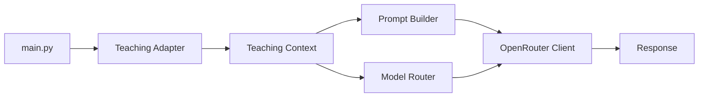

# Calc Engagement MVP

This repository is a public-facing minimum viable product for an AP Calculus tutoring workflow built around the Capillary Actions SDK. It is intentionally not the final architecture. The goal of this repo is to show the working foundations: how learner state, knowledge graphs, prompt assembly, model routing, and LLM execution fit together today, and how those pieces can be split into smaller reusable modules next.

## What This Demo Does

The current flow is simple:

1. Build a teaching context for a learner and a target concept.
2. Build a prompt from that context.
3. Choose a model based on the recommended teaching mode.
4. Send the prompt to OpenRouter and print the response.

That makes this repo useful as a reference implementation, but it is still fairly monolithic. The next step is to separate the agentic layer from the execution routine so a routine can stand on its own, be defined externally, and then be executed by a different agent or runtime.



## Repo Layout

- `main.py` runs the end-to-end demo.
- `adapters/knowledge_graph_adapter.py` defines example Calculus concepts and prerequisite relationships.
- `adapters/learner_progress_adapter.py` stores learner mastery data.
- `adapters/teaching_adapter.py` builds the teaching context consumed by the prompt.
- `prompts/prompt_builder.py` turns context plus user input into a prompt.
- `routing/model_router.py` selects a model from the teaching mode.
- `llm/openrouter_client.py` sends the prompt to OpenRouter.
- `retrieval/retriever.py` is the current placeholder for retrieval logic.

## Getting Started

1. Install Python dependencies used by the demo.
2. Create a `.env` file in the project root.
3. Add your own `OPENROUTER_API_KEY` value.
4. Run `main.py`.

Keep `.env` local and out of source control.

Example environment setup:

```bash
OPENROUTER_API_KEY=your_key_here
```

Run the demo:

```bash
python main.py
```

## How To Personalize It

If you want to adapt this MVP to your own tutoring workflow, the fastest changes are:

- Change the target concept in `main.py` when calling `build_context(...)`.
- Update the prompt template in `prompts/prompt_builder.py` to reflect your tone, structure, or output format.
- Change the routing logic in `routing/model_router.py` if your use case needs different models for different teaching styles.
- Replace the hard-coded example learner state in `adapters/teaching_adapter.py` with real learner data.
- Expand `adapters/knowledge_graph_adapter.py` with your own domain concepts, tags, and prerequisite chains.
- Add retrieval behavior in `retrieval/retriever.py` when you want the system to pull in documents, lessons, or prior attempts instead of relying only on static context.

## Capillary SDK Foundation

This repo is meant to show how the Capillary-style pieces fit together:

- A knowledge graph defines what can be taught.
- Learner progress tracks what the learner already knows.
- A teaching context combines concept state, learner state, and working memory.
- A prompt builder turns that context into an LLM-ready instruction.
- A model router chooses the right model for the teaching mode.
- A client layer actually executes the request.

That separation matters because it lets the teaching logic stay stable even when the underlying execution changes.

## How To Break This Up Next

The biggest architectural improvement is to package the routine separately from the agent.

Instead of one repo where the routine, prompting, routing, and execution are all coupled together, the next version should make the routine standalone. A future routine definition could live in YAML and describe enough of the behavior that any compatible agent can execute it remotely.

That gives you a cleaner boundary:

- the routine defines what should happen,
- the agent decides how to execute it,
- the tools handle narrow tasks such as validation, retrieval, or grading without guessing.

This also makes the system easier to test. For example, a calculus homework validator should be able to inspect an answer against a rubric or prerequisite graph rather than inventing missing reasoning.

## Practical Extension Ideas

1. Move the demo flow into a reusable routine definition.
2. Define input/output contracts for each module so the execution layer stays predictable.
3. Add a validation tool that checks calculus work against known concepts and prerequisites.
4. Replace the hard-coded sample learner and concept data with persistent storage.
5. Add retrieval so the system can reference prior lessons, notes, or homework attempts.

## Notes

- This project is a demo, not a production system.
- The prompt format, routing rules, and teaching context are all meant to be edited.
- The current code intentionally shows the seams you would later extract into independent tools or remote routines.
